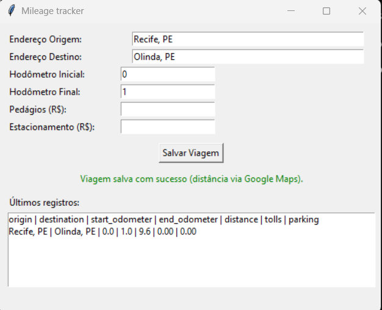

# Mileage Tracker

## Descrição
O Mileage Tracker é um aplicativo de desktop simples projetado para indivíduos e empresas rastrearem a quilometragem percorrida. Seu objetivo principal é facilitar a prestação de contas (expense reporting) e o reembolso de despesas de viagem.
A ferramenta automatiza o cálculo da distância e permite a exportação de todos os dados para um formato de tabela (.csv).

## Funcionalidades
- Registro de Viagens: Inserção de dados básicos da viagem (endereços, hodômetro, pedágios, estacionamento).
- Cálculo Automático de KM: Utiliza a **Google Maps Routes API** (Compute Route Matrix) para calcular a distância entre os endereços, com fallback para cálculo por hodômetro quando a API não estiver disponível.
- Cálculo de Despesas: Consolida o custo total baseado na quilometragem, pedágios e taxas de estacionamento.
- Exportação de Dados: Gera e exporta os dados e cálculos da viagem para um arquivo .csv.

## Executando a aplicação

1. Faça clone do repositório ou baixe o ZIP.
2. No diretório principal do projeto, crie a imagem Docker:
   ```
   docker build -t mileage_app .
   ```

3. Crie a pasta de dados (host) para persistência do CSV:
   ```
   mkdir -p data
   ```

4. Execução por sistema operacional

- Linux (X11 nativo)
  - Permita acesso ao X para o container e rode:
    ```
    xhost +local:root
    docker run -e DISPLAY=$DISPLAY \
      -v /tmp/.X11-unix:/tmp/.X11-unix \
      -v "$(pwd)/data":/aplication/data \
      -it --rm mileage_app
    xhost -local:root
    ```

- macOS (XQuartz)
  - Instale e abra o XQuartz. Em Preferences → Security, habilite "Allow connections from network clients". Reinicie o XQuartz.
  - No terminal:
    ```
    xhost + 127.0.0.1
    docker run -e DISPLAY=host.docker.internal:0 \
      -v "$(pwd)/data":/aplication/data \
      -it --rm mileage_app
    xhost - 127.0.0.1
    ```
  - Observação: algumas configurações podem exigir ajustes no DISPLAY (por exemplo host.docker.internal:0.0).

- Windows (VcXsrv / Xming / Docker Desktop)
  - Inicie VcXsrv (ou Xming) com "Disable access control" para testes locais.
  - Abra PowerShell/CMD no diretório do projeto:
    ```
    docker run -e DISPLAY=host.docker.internal:0 \
      -v "%cd%/data":/aplication/data \
      -it --rm mileage_app
    ```
  - Se usar WSL2 + X server no Windows, ajuste DISPLAY conforme seu setup (ex.: export DISPLAY=$(cat /etc/resolv.conf | grep nameserver | awk '{print $2}'):0).

5. Execução local sem Docker (para teste rápido)
   - Antes da primeira execução local, instale as dependências Python (incluindo o cliente HTTP e o carregador de variáveis de ambiente usados pela API do Google):
     ```
     pip install -r requirements.txt
     ```
   - Em seguida, execute a aplicação:
     ```
     python3 app/app.py
     ```
     (No Windows, o comando pode ser python app/app.py dependendo da instalação.)

## Configuração da Google Maps API (Routes API)
A aplicação utiliza a Google Maps Routes API, especificamente o endpoint distanceMatrix/v2:computeRouteMatrix, para calcular a distância entre o endereço de origem e o endereço de destino. Quando a chamada à API falha ou não há chave configurada, o sistema continua funcionando normalmente, usando apenas o hodômetro para calcular a distância.

### Modelo de créditos / cobrança (resumo)
Novos clientes do Google Cloud recebem um Free Trial de 90 dias com US$ 300 em créditos. Durante esse período, tudo o que normalmente seria cobrado é descontado desses créditos. 

O trial termina automaticamente quando:
- acabam os US$ 300, ou
- passam os 90 dias (o que ocorrer primeiro).

Nesse momento, os recursos são interrompidos; você não é cobrado automaticamente. Para continuar usando, é preciso ativar manualmente uma conta paga (upgrade para pay-as-you-go). 

No modelo atual da Google Maps Platform, cada SKU tem uma franquia gratuita mensal. Para SKUs da categoria Essentials, como Routes: Compute Route Matrix Essentials, há 10.000 eventos mensais gratuitos por SKU. 

Acima desse limite, a cobrança de referência hoje é de US$ 5,00 por 10.000 eventos (consultar tabela oficial para valores atualizados).

Para uso acadêmico e de pequeno porte (como neste projeto), é bem provável que o consumo permaneça dentro da faixa gratuita.

### Passo a passo: criar o projeto e ativar a Routes API
- Acesse o Google Cloud Console: https://console.cloud.google.com/
- Faça login com sua conta Google.
- No topo da tela, clique no seletor de projetos e crie um novo projeto (ou selecione um projeto existente que você queira usar).
- Siga o fluxo de criação de conta de faturamento e ative o Free Trial (90 dias / US$ 300), se ainda não tiver feito isso.
- No menu lateral, vá em “APIs e serviços” → “Biblioteca”.
- Na barra de busca, digite “Routes API”.
- Clique em Routes API e depois em “Ativar”.

### Passo a passo: criar a API key e configurar API restriction
- Ainda em “APIs e serviços”, clique em “Credenciais”.
- Clique em “+ Criar credenciais” → “Chave de API” (API key).
- Uma nova chave será exibida na tela. Clique em “Restringir chave” (Restrict key).
- Na seção “Protect your API key”:
  - Em Select restriction type, escolha API restriction.
  - Na lista de APIs abaixo:
    - Role a lista ou use o campo de filtro até encontrar “Routes API”.
    - Marque apenas Routes API.
    - Não é necessário marcar Distance Matrix API (ela é legada e não é usada neste projeto).
- Clique em “OK” e depois em “Save” (Salvar).
- Copie o valor da sua API key (uma string longa).

### Passo a passo: configurar a chave no projeto (.env)
- Na raiz do projeto existe o arquivo de exemplo .env.example.
- Crie o arquivo .env com base nele:
  ```
  cp .env.example .env
  ```
- Abra o arquivo .env e edite a linha:
  ```
  GOOGLE_MAPS_API_KEY=SUA_CHAVE_AQUI
  ```
- Substitua SUA_CHAVE_AQUI pela chave que você copiou do Google Cloud Console.

## Testes
Os testes da aplicação encontram-se no diretório test. Execute:
```
python3 -m unittest discover -s test
```
## Exemplo de uso com Google Maps



## Observações
- A aplicação grava em /aplication/data/trips.csv dentro do container; ao mapear ./data do host para /aplication/data, os registros ficam no host.
- Uso de X11 em contêiner envolve riscos de segurança; habilite acesso apenas para testes e revogue com xhost - após o uso.
- O uso da Google Maps API neste projeto é incremental: primeiro a distância é calculada pelo hodômetro; se a API estiver configurada e responder corretamente, o valor retornado pela Routes API substitui a distância em km. Em caso de falhas na API, o usuário recebe uma mensagem de aviso clara e o cálculo por hodômetro é mantido.
- Se você encontrar o erro 400, experimente excluir a API atual e criar uma nova sem restrições. Em seguida, execute o software. Se obtiver sucesso, adicione as restrições posteriormente apenas na API, sem aplicar restrições ao app na página da API. A restrição em questão refere-se às rotas da API (API Routes).